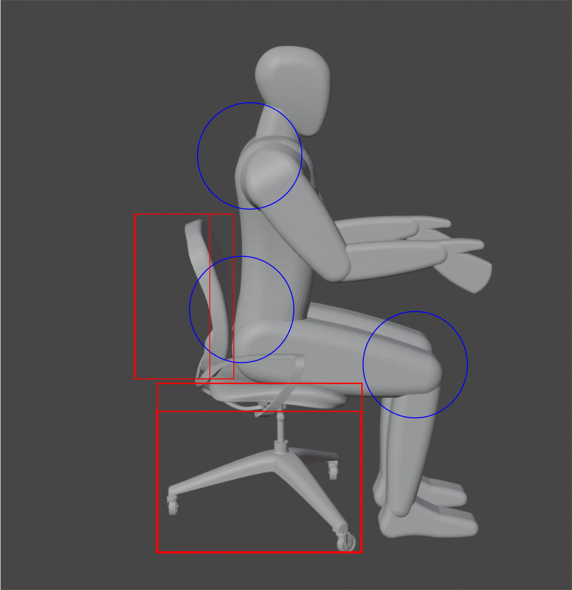

# Topology optimization

- [TL;DR](#tldr)
- [Dash app](#dash)
- [3 ways under the hood](#3-ways-under-the-hood)
  - [scipy](#scipy)
  - [CuPy](#cupy)
  - [pyCUDA](#heading-1)
    - [Sparse solvers in CUDA](#sparse-solvers-in-cuda)
- [How to use it](#how-to-use-it)
  - [Launching dash app](#launching-dash-app)
  - [From commandline](#from-commandline)
  - [From Google colab](#from-google-colab)
- [Where can we go from this simple example](#where-can-we-go-from-this-simple-example)

<!-- toc -->

## TL;DR

- This repo is a POC (proof of concept) to use CUDA-based sparse solvers on GPUs.
- This repo implements SIMP-based topology optimization for compliance minimization (aka find the stiffest possible structure under a given loading.)
- Contains re-implementation of the famous [**A 99 line topology optimization code written in Matlab**](https://www.topopt.mek.dtu.dk/Apps-and-software/A-99-line-topology-optimization-code-written-in-MATLAB)
- Uses CUDA sparse solvers for solving linear system of equations on GPU
- A dash webapp is developed that interfaces with the backend physics. This webapp can be called directly from the `google colab`.
- The code can be run locally from commandline as well without the webapp
- For larger degrees of freedom, the CUDA version is significantly faster than CPU version. And hence lets you do more design iterations. Typically these PDE constrained problems are compute heavy and people often resort to MPI parallelization. With the advent of free sparse solvers GPUs and free compute environments like google colab, design can be pushed to new limits with faster turnaround times.

## Dash app


## 3 ways under the hood

### scipy

`scipy` offers various linear solvers. We use `spsolve` from `scipy.sparse.linalg`.

### CuPy

CuPy is designed as NumPy-equivalent library so users can benefit from fast GPU computation without learning CUDA syntax.

### pyCUDA

PyCUDA connects the high-level Python programming language with the Nvidia CUDA compute abstraction. PyCUDA provides computational linear algebra involving vectors and multi-dimensional arrays that are designed to match the interface of the widely-used (CPU-based) Python array package `numpy`.

### Sparse solvers in CUDA

One way to solve general sparse linear systems in CUDA is using cuSOLVER.

cuSOLVER has three useful routines:

- `cusolverSpDcsrlsvlu`, which works for square linear systems (number of unknowns equal to the number of equations) and internally uses sparse LU factorization with partial pivoting;
- `cusolverSpDcsrlsvqr`, which works for square linear systems (number of unknowns equal to the number of equations) and internally uses sparse QR factorization;
- `cusolverSpDcsrlsqvqr`, which works for rectangular linear systems (number of unknowns different to the number of equations) and internally solves a least square problem.

#### Notes on `cusolverSpDcsrlsvlu`

Attention should be paid to two input parameters: tol and reorder. Concerning the former, if the system matrix A is singular, then some diagonal elements of the matrix U of the LU decomposition are zero. The algorithm decides for zero if |U(j,j)| < tol.
Concerning the latter, cuSOLVER provides a reordering to reduce zero fill-in which dramactically affects the performance of LU factorization. reorder toggles between reordering (reorder=1) or not reordering (reorder=0).

Attention should be paid also to an output parameter: singularity. It is -1 if A is invertible, otherwise it provides the first index j such that U(j,j)=0.

#### Notes on `cusolverSpDcsrlsvqr`

Attention should be paid to the same input/output parameters are before. In particular, tol is used to decide for singularity, reorder has no effect and singularity is -1 if A is invertible, otherwise it returns the first index j such that R(j,j)=0.

#### Notes on `cusolverSpDcsrlsqvqr`

Attention should be paid to the input parameter tol, which is used to decide the rank of A.

## How to use it

### Launching dash app

- Check out this git repo using jupyter-dash
- Install the dependencies (dash, pycuda, cupy etc)
- From the commandline execute `python UI.py`

### From commandline

- From the commandline execute `python main.py`

### From Google colab

Google colab comes pre-installed with a lot of CUDA libraries. You can serve this dash app from within the colab notebook by using the following commands:

`!pip install -q jupyter-dash==0.3.0rc1 dash-bootstrap-components transformers`

```
%%sh
pip install -q dash
pip install -q dash_core_components
pip install -q dash_html_components
pip install -q dash_table
pip install jupyter-dash
pip install pycuda
```

```
import os
from pathlib import Path
from google.colab import drive

drive.mount("/content/gdrive")
path = Path("/content/gdrive/My Drive/Code")
path.mkdir(parents=True, exist_ok=True)
os.chdir(path)

! rm -r dash_app_topology
! git clone -b separate https://github.com/prav-nak/dash_app_topology.git
os.chdir("dash_app_topology")
```

```
from UI import *
app.run_server(debug=True, port=8050, mode='external')
```

If you want to terminate the current running app,

```
app._terminate_server_for_port("localhost", 8050)
```

## Where can we go from this simple example

Topology optimization can be used ubiquitously whenever there is design involved. One simple practical example (not part of this public repo. Please feel free to reach out to me if interested in this topic.) is as follows:

- Sitting is a static posture that can cause increased stress in the back, neck, arms and legs, and can add a tremendous amount of pressure to the back muscles and spinal discs.

- Designing ergonomic furniture can alleviate some of these problems

This can easily be formulated as a combined shape and topology optimization with stress minimization at certain regions of interest as the objective function. A finite element model for can be generated for a concept design shown below. (full details are out of the scope in this POC for sparse solvers on GPUs.). However it highlights the quicker one can go from concept to optimal designs through faster solvers.


We can divide our domain into design and non-design domain partitions and can use a combined shape and topology optimization. For this problem setting, we can come up with ergonomic designs that are easy on the body.


